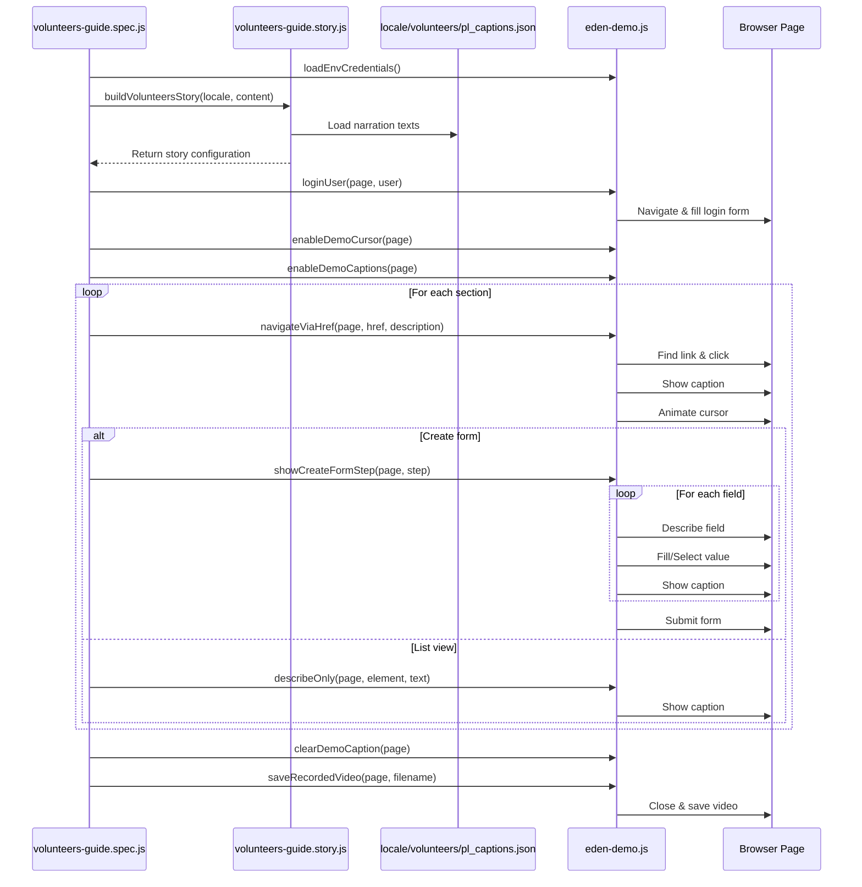
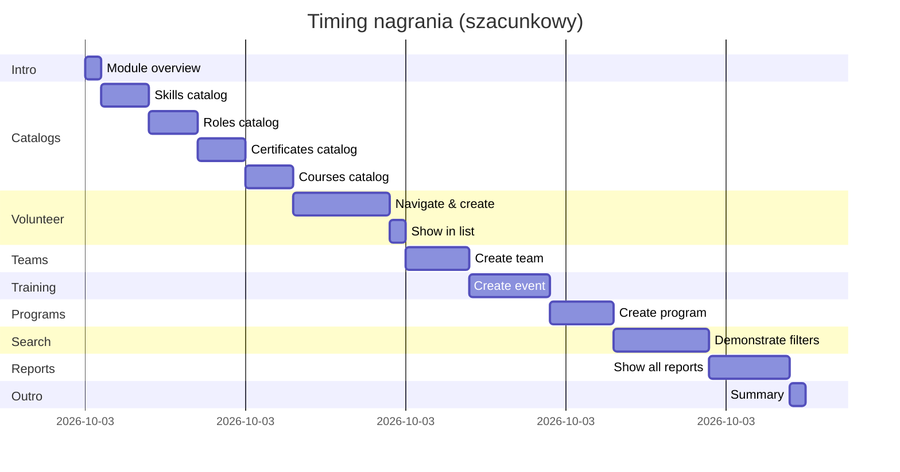

# Architektura nagrania modułu Volunteers

## Diagram przepływu nagrania

```mermaid
graph TD
    A[Start Recording] --> B[Login & Setup Context]
    B --> C[Create Recording Context with Video]
    C --> D[Enable Demo Cursor & Captions]
    D --> E[Navigate to /eden/vol/index]
    
    E --> F[INTRO: Show Module Overview]
    F --> G[Configuration Catalogs Phase]
    
    G --> G1[Skill Catalog]
    G1 --> G1a[Navigate to Skills List]
    G1a --> G1b[Create New Skill]
    G1b --> G1c[Show Created Skill]
    
    G1c --> G2[Role Catalog]
    G2 --> G2a[Navigate to Roles List]
    G2a --> G2b[Create New Role]
    G2b --> G2c[Show Created Role]
    
    G2c --> G3[Certificate Catalog]
    G3 --> G3a[Navigate to Certificates List]
    G3a --> G3b[Create New Certificate]
    G3b --> G3c[Show Created Certificate]
    
    G3c --> G4[Course Catalog]
    G4 --> G4a[Navigate to Courses List]
    G4a --> G4b[Create New Course]
    G4b --> G4c[Show Created Course]
    
    G4c --> H[Volunteer Registration Phase]
    
    H --> H1[Navigate to Volunteers List]
    H1 --> H2[Navigate to Create Volunteer]
    H2 --> H3[Fill Personal Data]
    H3 --> H4[Fill Contact Info]
    H4 --> H5[Assign Skills]
    H5 --> H6[Set Availability]
    H6 --> H7[Save Volunteer]
    H7 --> H8[Show in List]
    
    H8 --> I[Teams Phase]
    
    I --> I1[Navigate to Teams List]
    I1 --> I2[Create New Team]
    I2 --> I3[Assign Team Members]
    I3 --> I4[Show Team List]
    
    I4 --> J[Training Phase]
    
    J --> J1[Navigate to Training Events]
    J1 --> J2[Create Training Event]
    J2 --> J3[Assign Course]
    J3 --> J4[Assign Participants]
    J4 --> J5[Show Training List]
    
    J5 --> K[Programs Phase]
    
    K --> K1[Navigate to Programs]
    K1 --> K2[Create New Program]
    K2 --> K3[Register Hours]
    K3 --> K4[Show Program Summary]
    
    K4 --> L[Search & Filter Phase]
    
    L --> L1[Navigate to Volunteers List]
    L1 --> L2[Demo Search by Skills]
    L2 --> L3[Demo Filter by Status]
    L3 --> L4[Demo Filter by Location]
    L4 --> L5[Show Search Results]
    
    L5 --> M[Reports Phase]
    
    M --> M1[Navigate to Reports]
    M1 --> M2[Show Volunteer Report]
    M2 --> M3[Show Hours by Role]
    M3 --> M4[Show Hours by Program]
    M4 --> M5[Show Training Report]
    
    M5 --> N[OUTRO: Summary]
    N --> O[Clear Caption]
    O --> P[Wait & Save Video]
    P --> Q[End Recording]
```



## Struktura plików

```
eden-demo-automation/
├── src/
│   ├── locale/
│   │   └── volunteers/
│   │       ├── pl_captions.json           # Teksty narracji PL
│   │       └── pl_values.json             # Dane formularzy PL
│   ├── recordings/
│   │   ├── volunteers-guide.spec.js       # Główny skrypt nagrania
│   │   └── volunteers-guide.story.js      # Story builder z definicjami
│   └── helpers/
│       ├── eden-demo.js                   # Istniejące helpery
│       ├── recording-steps.js             # Istniejące helpery
│       └── volunteers-flow.js             # NOWY: Helpery dla volunteers
├── temp/
│   └── volunteers_guide_pl.md             # Źródłowy przewodnik
├── package.json                           # Dodać skrypt npm
└── VOLUNTEERS_RECORDING_PLAN.md           # Ten dokument
```

## Przepływ danych



## Kluczowe komponenty

### 1. Story Builder (`volunteers-guide.story.js`)

```javascript
// Struktura story buildera
module.exports = {
  buildVolunteersStory(locale, content) {
    return {
      intro: { ... },
      catalogs: {
        skills: { section, create, fields },
        roles: { section, create, fields },
        certificates: { section, create, fields },
        courses: { section, create, fields }
      },
      volunteer: {
        section, create, fields
      },
      team: {
        section, create, fields
      },
      training: {
        section, create, fields
      },
      program: {
        section, create, fields
      },
      search: {
        filters: [ ... ]
      },
      reports: {
        types: [ ... ]
      }
    }
  }
}
```

### 2. Locale Files (`locale/volunteers/pl_captions.json`, `locale/volunteers/pl_values.json`)

```json
{
  "intro_caption": "Moduł Volunteers...",
  "intro_purpose": "Cel modułu...",
  
  "section_skills": "Katalog umiejętności...",
  "create_skill": "Tworzymy nową umiejętność...",
  "skill_name": "Nazwa umiejętności...",
  
  "section_volunteers": "Lista wolontariuszy...",
  "create_volunteer": "Rejestrujemy nowego wolontariusza...",
  "volunteer_first_name": "Imię wolontariusza...",
  
  "search_intro": "Wyszukiwanie wolontariuszy...",
  "filter_by_skills": "Filtrowanie według umiejętności...",
  
  "reports_intro": "Raporty i analiza...",
  "report_volunteer": "Raport wolontariuszy..."
}
```

### 3. Main Spec (`volunteers-guide.spec.js`)

```javascript
test('records volunteers guide', async ({ browser, baseURL }) => {
  // Phase 1: Setup
  const user = loadEnvCredentials();
  const content = buildDemoContent('vol');
  const story = buildVolunteersStory(locale, content);
  
  // Phase 2: Login
  const setupContext = await browser.newContext({ baseURL });
  const setupPage = await setupContext.newPage();
  await loginUser(setupPage, user);
  const storageState = await setupContext.storageState();
  await setupContext.close();
  
  // Phase 3: Recording
  const recordedContext = await browser.newContext({
    baseURL,
    storageState,
    viewport: RECORDING_VIEWPORT,
    recordVideo: { ... }
  });
  const page = await recordedContext.newPage();
  
  await enableDemoCursor(page);
  await enableDemoCaptions(page);
  
  // Phase 4: Execute story
  await page.goto('/eden/vol/index');
  await showStandaloneCaption(page, story.intro.caption);
  
  // Catalogs
  await createSkill(page, story.catalogs.skills);
  await createRole(page, story.catalogs.roles);
  await createCertificate(page, story.catalogs.certificates);
  await createCourse(page, story.catalogs.courses);
  
  // Volunteer
  await createVolunteer(page, story.volunteer);
  
  // Team
  await createTeam(page, story.team);
  
  // Training
  await createTraining(page, story.training);
  
  // Program
  await createProgram(page, story.program);
  
  // Search
  await demonstrateSearch(page, story.search);
  
  // Reports
  await showReports(page, story.reports);
  
  // Phase 5: Finish
  await clearDemoCaption(page);
  await page.waitForTimeout(RECORDING_FINISH_DELAY_MS);
  await saveRecordedVideo(page, 'volunteers-guide.webm');
});
```

## Wzorce implementacyjne

### Pattern 1: Nawigacja do sekcji
```javascript
await showPageStep(page, {
  href: '/eden/vol/skill',
  description: locale.section_skills,
  delay: 2000
});
```

### Pattern 2: Tworzenie rekordu
```javascript
await showCreateFormStep(page, {
  sectionHref: '/eden/vol/skill',
  sectionDescription: locale.section_skills,
  createHref: '/eden/vol/skill/create',
  createDescription: locale.create_skill,
  firstFieldSelector: '#hrm_skill_name',
  fields: [
    { action: 'fill', selector: '#hrm_skill_name', 
      description: locale.skill_name, value: 'Pierwsza pomoc' },
    { action: 'select', selector: '#hrm_skill_type', 
      description: locale.skill_type, value: 'Medical' }
  ]
});
```

### Pattern 3: Demonstracja wyszukiwania
```javascript
await navigateViaHref(page, '/eden/vol/volunteer/summary', 
  locale.search_intro);
await describeOnly(page.locator('.filter-form'), 
  locale.filter_explanation);
await fillSearchForm(page, story.search.filters);
await describeOnly(page.locator('.datatable'), 
  locale.search_results);
```

## Timing i synchronizacja



## Obsługa błędów i edge cases

1. **Brak danych w katalogach**
   - Sprawdzenie czy katalogi są puste
   - Utworzenie minimalnych danych jeśli potrzebne

2. **Istniejące dane**
   - Użycie timestamp w nazwach dla unikalności
   - Sprawdzenie czy rekord już istnieje przed utworzeniem

3. **Pola opcjonalne**
   - Użycie `ifVisible: true` dla pól które mogą nie być widoczne
   - Fallback dla select'ów: `fallbackSelect: 'firstAvailable'`

4. **Timeouty**
   - Użycie odpowiednich timeoutów dla nawigacji
   - Czekanie na `networkidle` po nawigacji
   - Czekanie na widoczność kluczowych elementów

5. **Formularze wieloetapowe**
   - Sprawdzenie czy formularz ma zakładki/sekcje
   - Nawigacja między sekcjami jeśli potrzebne

## Metryki sukcesu

- ✅ Wszystkie sekcje z przewodnika pokryte
- ✅ Wszystkie scenariusze praktyczne pokazane
- ✅ Czas nagrania: 22-30 minut
- ✅ Brak błędów podczas nagrywania
- ✅ Wszystkie captions czytelne i zsynchronizowane
- ✅ Płynne przejścia między sekcjami
- ✅ Dane testowe realistyczne i spójne
